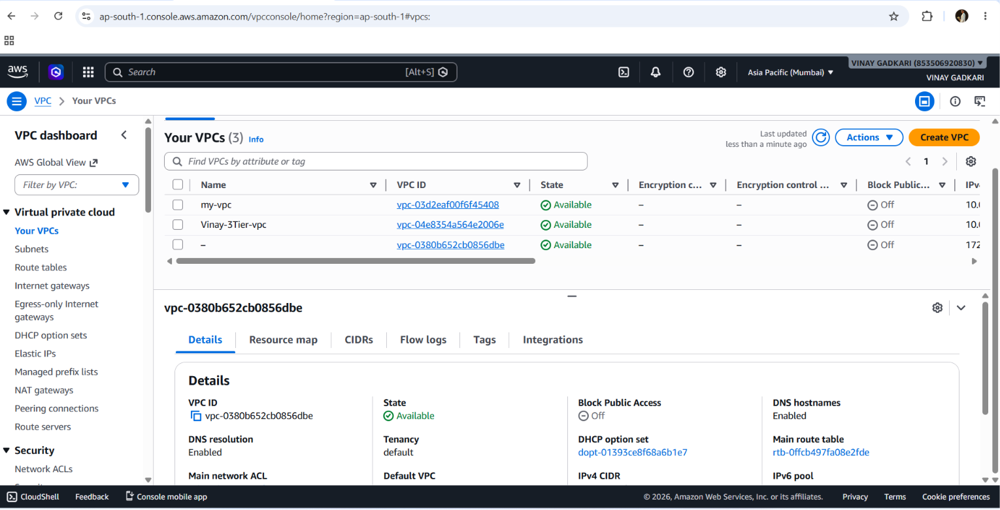
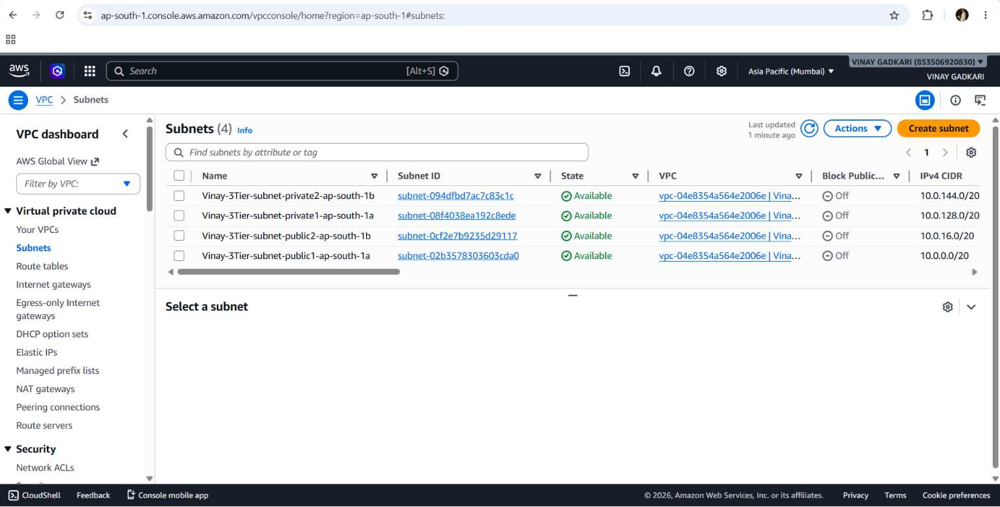
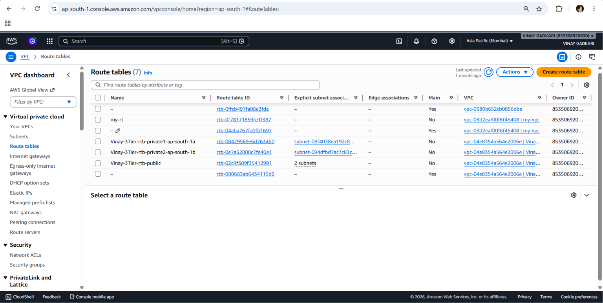
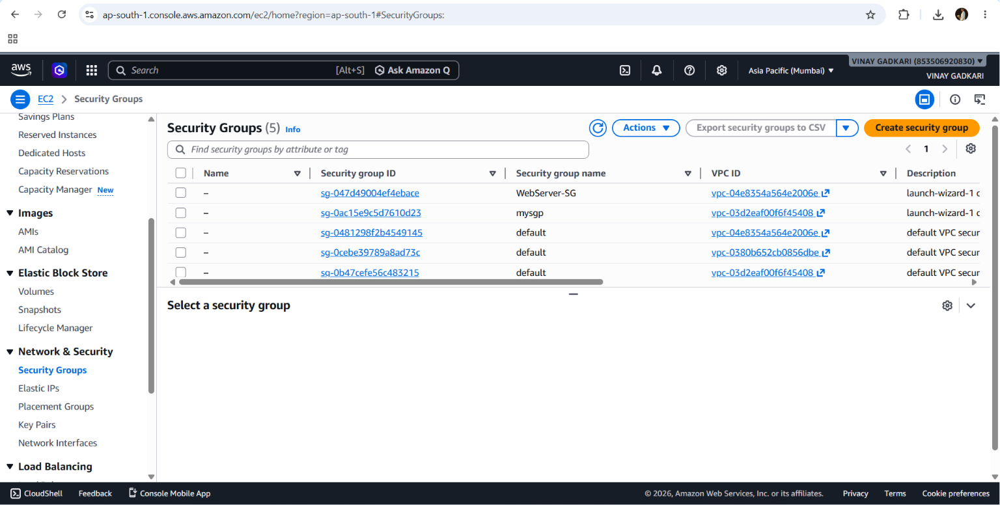
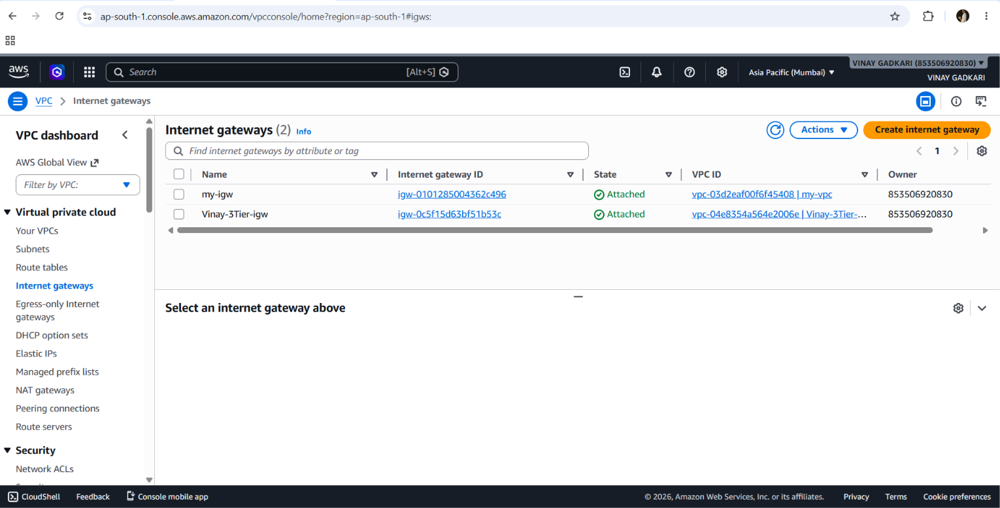
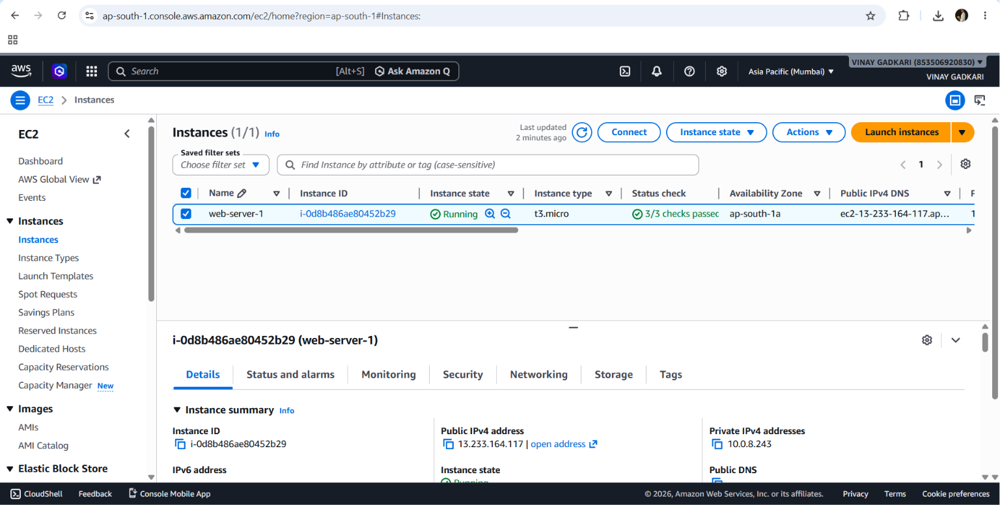
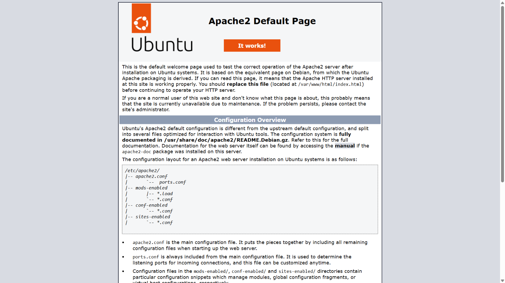

# AWS 3-Tier Web Application

## Project Overview

This project demonstrates the deployment of a 3-Tier Architecture on AWS using a custom VPC and EC2 web server.

## AWS Services Used

- Amazon VPC
- Amazon EC2
- Internet Gateway
- Route Tables
- Security Groups
- Apache Web Server

## Completed Tasks

- Created Custom VPC
- Configured Public and Private Subnets
- Configured Internet Gateway
- Launched EC2 Instance
- Installed Apache Web Server
- Verified Web Application Access

## Screenshots

### VPC Configuration

### Subnets

### Route Table

### Security Group

### Internet gateway

### EC2 Instance

### Apache Web Server

## Skills Demonstrated

- AWS Networking
- EC2 Administration
- Linux Administration
- Apache Web Server Deployment
- Security Group Configuration
